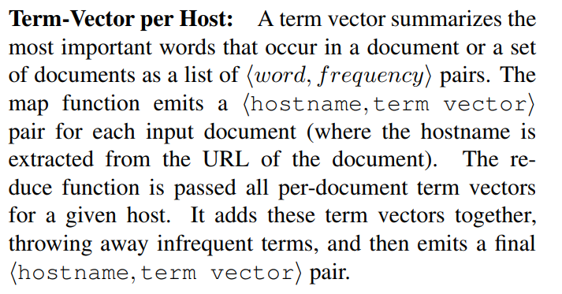

# MIT-6.824-2020-DistributedSystems

## 1. MapReduce

### 1.1 Programming Model

Map

> Map, written by the user, takes an input pair and produces a set of intermediate key/value pairs. The MapReduce library groups together all intermediate values associated with the same intermediate key I and passes them to the Reduce function. 
>
> Map 接受一个输入对并生成一组中间键/值对。MapReduce库将所有与相同的中间键I关联的中间值组合在一起，并将它们传递给Reduce函数。

Reduce

> The Reduce function, also written by the user, accepts an intermediate key I and a set of values for that key. It merges together these values to form a possibly smaller set of values. Typically just zero or one output value is produced per Reduce invocation. The intermediate values are supplied to the user’s reduce function via an iterator. This allows us to handle lists of values that are too large to fit in memory .
>
> Reduce函数也是由用户编写的，它接受一个中间键I和该键的一组值。它将这些值合并在一起，形成可能更小的一组值。通常，每个Reduce调用只生成0或1个输出值。中间值通过迭代器提供给用户的reduce函数。这允许我们处理太大而无法放入内存中的值列表。

### 1.2 Example 

考虑在一个大的文档集合中计算每个单词出现的次数的问题。

map函数发出每个单词和一个相关的出现次数计数(在这个简单的示例中只有“1”).

reduce函数将为特定单词发出的所有计数汇总在一起.

<video src="../MapReduce.mp4"></video>

### 1.3 More Examples

> #### 分布式Grep
>
> 

> #### URL访问频率的计数:
>
> 

> #### 反向web链接图
>
> 

> #### Term-Vector per Host
>
> 

> #### 倒排索引
>
> 

> #### Distributed Sort
>
> 

 

### 1.4 Fault Tolerance

> #### Worker Failure 
>
> 

> #### Master Failure
>
> 

### 1.5 Task Granularity 

> Ideally, M and R should be much larger than the number of worker machines.  
>
> 

### 1.6 Status Information 

> 

### 1.7 Conclusions 

